# scientific_diary_20_22
[Disentangled Graph Collaborative Filtering](https://arxiv.org/pdf/2007.01764.pdf)  

This work is dedicated to the problem of disentangling of the factors related to the different user intents. The authors take the CF task: prediction of the items which might interest the user, and turn it into the task with a bipartite graph structure. Now when they have two groups of nodes: items and users, and edges between them mark the history of user's interests, emrges the problem of disantangling of different user intent types.
Intents here take the form of latent variables. The idea is then to choose the number ($K$) of this latent variables and let the model itself to learn which item-user connection is influenced by which intent. The authors build multi-graph where each edge type corresponds to the one of the intents and then devide the node embeddings into $K$ chunks as well. 

One of the important details is that there are no learnable parameters in the model except the embeddings itself (LightGCN). Nevertheless it's doubious that the proposed pipeline is easy to scale to large graphs since experiments were taken only on datasets with modest number of nodes.

Moreover the graph structure is too learned by the model itself and it makes it hard to commit personalized page rank convolution to this pipeline. Instead authors use the multiple layers and it has well known disadvantages such as oversmoothing and bad scalability even in stochastic scenario.

The BPR loss is used for the recommendation task with the [distance correlation](https://en.wikipedia.org/wiki/Distance_correlation) based regularization. 

One of the interesting properties of the obtained intensions is that we can lower the least important intension value with no harm but not zero it out. The Authors call this property vitamine.

[MultiSage: Empowering GCN with Contextualized Multi-Embeddings on Web-Scale Multipartite Networks](https://www-cs-faculty.stanford.edu/people/jure/pubs/multisage-kdd20.pdf)

The article is about the utilization of GCN for the purpose of item to item recomendations.

The authors mainly itnroduce the new model for bipartite graphs. Graphs are obtained with the suggestion that every target nodes pair is connected via some context node (Ex. images are pinned to a board). To process such graphs effeciently authors take the advantage of APPNP. They also implement new type of attention and use context nodes represenations as some sort of mask for the features of target nodes. [slides](https://docs.google.com/presentation/d/1jnnq6K2kFhrBxRustHt83gSVIFvPaHKkOmjUThLhwV8/edit?usp=sharing)

------------

# scientific_diary_20_21

[INDUCTIVE REPRESENTATION LEARNING ON
TEMPORAL GRAPHS, ICLR 2020](https://openreview.net/pdf?id=rJeW1yHYwH)  

Многие графовые данные такие как социальные сети, графы цитирований, взаимодействия пользователей и товаров имеют временные зависимости. В данной работе авторы предложили новый способ обучения графовых сетей на таких данных.   
Главные тезисы данной работы:
* Для моделирования динамики признаков вершин графа во времени недостаточно использовать просто временные срезы, динамика должна выражаться неперывной функцией времени.
* Топология графа также меняется со временем, что добавляет ограничений на методы агрегации соседей

Основной результат работы новый графовый слой TGAT(temporal graph attention layer). Как и в слои GraphSAGE и 
GAT этот слой позволяет решать как трансдуктивные так и индуктивные задачи. Как и в GAT авторы используют механизм внимания для агрегации соседних(в пространственном и временном смысле) вершин. 

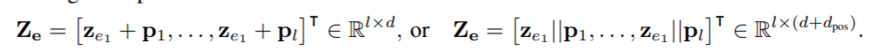</img> 

Для моделирования временной динамики в признаках авторы создают аналог [positional encoding](https://arxiv.org/abs/1706.03762) из своей прошлогодней [работы](https://arxiv.org/pdf/1911.12864.pdf). На картинке выше показан вход слоя трансформера, где $z_{e1}$ --  эмбеддинги входной последовательности, $p$ -- позиционные эмбеддинги. Выход такого слоя пересчитывается по формуле 
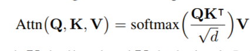</img> 
Где 
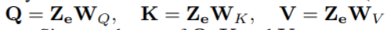</img> 
Авторы взяли данный механизм за основу и вместо позиционных эмбеддингов $p$ использовали временные.  
Допустим что функция $F: T \rightarrow R^{d_T}$ переводит время во временные эмбеддинги $p$. Тогда, если заметить, что коэффициенты внимания опираются только на скалярные произведения эмбеддингов но не на сами эмбеддинги, можно перейти к kernel trick. $K(t_1, t_2) = \langle F(t_1), F(t_2) = \psi(t1-t2) \rangle$.

Тем не менее для эффективного обучения нам необходимо явное представление эмбеддингов $p$. Для того чтобы его получить авторы используют теорему Бохнера. Используя то что ядро $K$ зависит от матрицы грамма и непрерывной функции $F$, можно утверждать что оно неотрицательно определено и непрерывно. Значит по вышеуказанной теореме такое ядро представимо в виде преобразования Фурье неотрицательной меры на $R$. При должном масштабировании авторы полагают что такой мерой может быть вероятностная, тогда

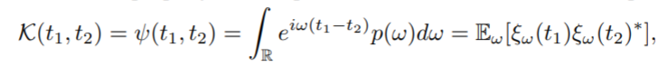</img>
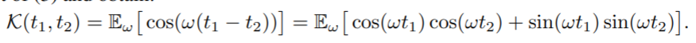</img>
Можно приблизить интеграл монте-карло оценкой
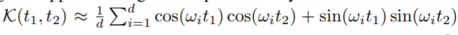</img>
В итоге эмбеддинг можно приблизить так
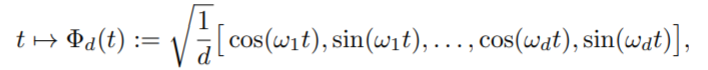</img>
Также авторы показывают что для того чтобы приблизить ядро с точностью $\epsilon$, достаточно чтобы эмеддинги имели размерность следующего порядка
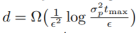</img>

На практике распределение весов $p(w)$ можно обучить с помощью нормализационных потоков, но авторы заметили что прямая оптимизация весов работает не хуже и при этом не использует лишние параметры.

### Архитектура TGAT
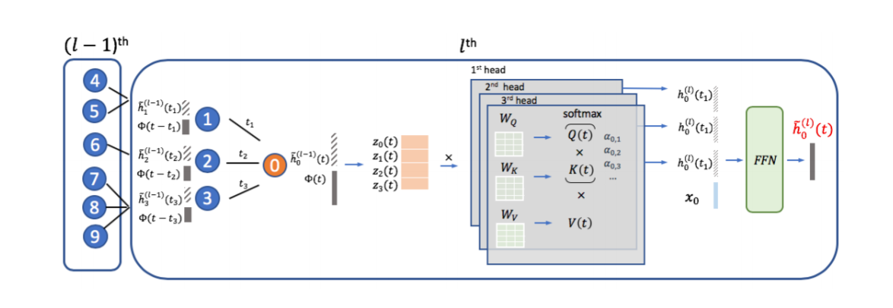</img>

Обозначим за $v_i$ и $x_i$ вершину и соответствующий ей набор признаков, $h_i^l(t)$ -- выход слоя $l$ для вершины $i$ в момент времени t. Для вершины $v_0$ в момент времени $t$ за окрестность обозначим $N(v_0;t) = \{v_1,\dots,v_N\}$ множество таких вершин $v_i$, которые связаны с $v_0$ в момент времени $t_i$, предшествующий $t$. 

Используя данные термины вход текущего слоя $l$ будет выглядеть так:
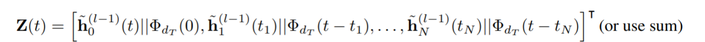</img>
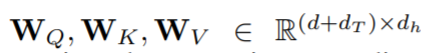</img>

По аналогии с трансформером введем обозначения:
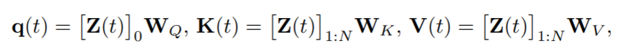</img>

Получим скрытое агрегированное представление соседних вершин:
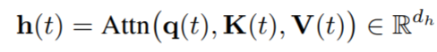</img>

Тогда выход слоя получается следующим преобразованием над скрытым представлением:
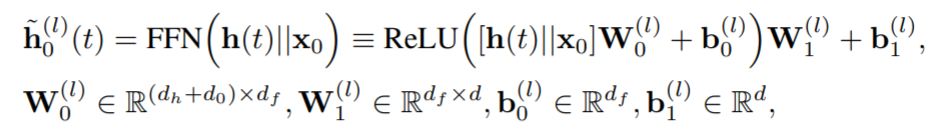</img>

### Эксперименты

Эксперименты проводились на данных из датасетов:
* [Reddit](http://snap.stanford.edu/jodie/reddit.csv) -- вершины графа - пользователи, ребра - комментарии.
* [Wikipedia](http://snap.stanford.edu/jodie/wikipedia.csv) -- вершины графа - пользователи, ребра - правки.
Основная задача -- предсказание будущих ребер:
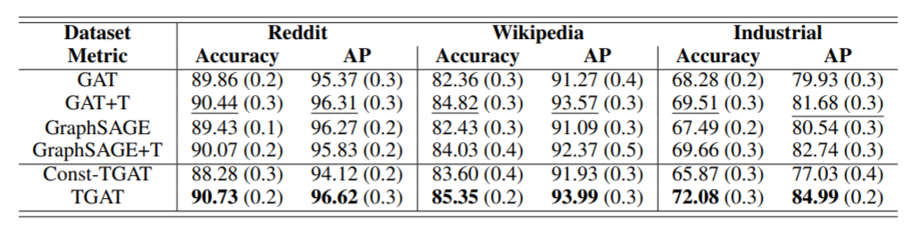</img>
ROC AUC для предсказания бана пользователя(метки вершин):
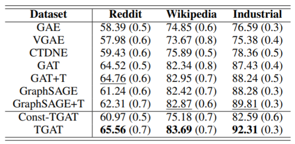</img>

[Fi-GNN (ACM CIKM ’19)](https://arxiv.org/pdf/1910.05552.pdf)

Множество работ посвящены тому, чтобы эффективно использовать категориальные признаки в глубинном обучении. Недавний тренд, направлен в сторону графовых сетей, они позволяют добавить в эмбеддинги категориальных признаках информацию о взаимодействии между такими признаками в выборке. 

**Задача**  
В данной работе авторы концентрируют внимание на задаче предсказания CTR(click-through rate). Особенность данных в таких задачах $-$ небольшое число категориальных признаков(несколько десятков) с зачастую огромным числом категорий(число категорий у разных признаков сильно различно). 
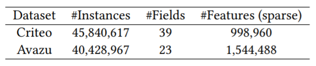</img>
На картинке выше представлены число категориальных признаков(2 столбец) и суммарное число категорий(3 столбец), на датасетах, использованных в работе.

**Замечание**  
Представленная авторами модель использует только взаимодействие первоначальными признаками(до one-hot преобразования).  Хотя такой подход позволяет сэкономить вычислительные ресурсы, интерес представляет по моему мнению использование взаимодействия между категориями. Так например не представляется возможным построить матрицу связности таких признаков отличную от полносвязной.

**Подход**  
Авторы используют графовую сеть для добавления к эмбеддингам категориальных признаков информации о межпризнаковом взаимодействии. Для этой цели они строят граф, вершины которого соответствуют категориальным признакам. За основу берется полносвязныйы граф, но веса его ребер обучаются вместе с моделью.

За основу своей модели авторы берут [GGNN](https://arxiv.org/pdf/1511.05493.pdf). Модернизируют эту модель, добавляя residual connection, пересчет весов ребер графа с помощью механизма внимания, индивидуальную трансформацию соседних вершин при агрегации.

Итоговый алгоритм:
1. Категориальный признак переводится в one-hot, а затем в эмбеддинг.
2. Эмбеддинги проходят через механизм внимания multihead self attention.
3. Графовая сеть:
    * Вычисление  агрегированого представления: 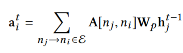</img> $A[n_i,n_j]$ - вес ребра, $W_p$ - функция трансформации(уникальная для каждого ребра), $h_j^t$ - внутренне представление вершины графа на слое t графовой сети.
    * обновление внутренних представлений вершин графа через GRU, 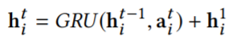</img>
4. Вычисление итогового результата. 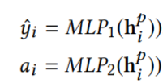</img> 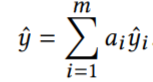</img>

Графическое изображение алгоритма:
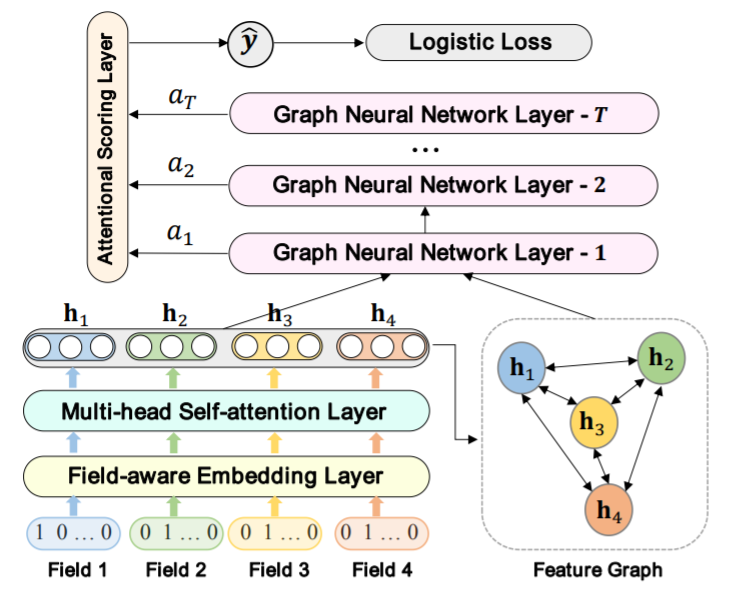</img>

 [CatGCN (2020)](https://arxiv.org/pdf/2009.05303.pdf)
 

[BOOST THEN CONVOLVE](https://openreview.net/pdf?id=ebS5NUfoMKL)  

В последние годы появились алгоритмы ([MGBDT](https://papers.nips.cc/paper/2018/file/39027dfad5138c9ca0c474d71db915c3-Paper.pdf), [NODE](https://arxiv.org/pdf/1909.06312.pdf) ), позволяющие обучать ансамбли и бустинги решающих
деревьев с помощью алгоритма обратного распространения ошибки. Такие алгоритмы позволяют учить многослойные представления
табличных данных, которые по нашему предположению могут быть
эффективно использованы при обучении графовых сверточных сетей. Более того, это обучение может проходить совместно, что повышает эффективность алгоритмов.
Данная работа, посвященная этой проблеме, использует
связку обычного градиентного бустинга и графовой сети, такая модель обучается совместно с помощью алгоритма описанного в [MGBDT](https://papers.nips.cc/paper/2018/file/39027dfad5138c9ca0c474d71db915c3-Paper.pdf).
Однако вышеупомянутая модель имеет ряд ограничений. Например,
авторы не изучают вопрос обучения с помощью градиентного бустинга многослойных скрытых представлений. Скрытый слой такой
модели представлен или в виде конкатенации изначальных признаков с выходом бустинга или только выходом бустинга, размерность
которого совпадает с размерностью целевой переменной(на первой
итерации бустинг учится предсказывать ее).
